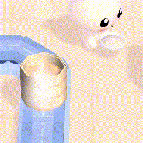
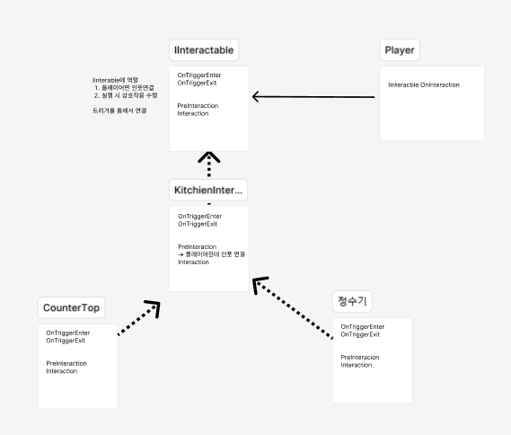

# [인터페이스] 다형성을 활용한 주방 기구 설계

## 개요



- 서로 다른 기능을 수행하는 주방기구들과 플레이어가 상호작용 해야 하는 상황에서 구조 고민
- 상속 구조를 통해서 코드 재사용 및 통일성 있는 메서드 호출
- 인터페이스로 확장성 고려

<br>

---

## 상속 구조와 인터페이스



- 인터페이스와 상속 설계로 Player에서 IInteractable을 통해 다양한 행동 가능하도록 구성
- 이에 따라 코드의 재사용성이 높아지고, 코드 유지 보수성이 향상됨

<br>

---

## 활용 결과

### 💫 코드의 유지보수성 및 재사용성 증가

**관련 코드**

- IInteractable.cs
    
    ```
    public interface IInteractable
    {    
        public void Interaction();
    
        public void PickUp();
    
        public void PutDown();
    }
    ```
    
- KitchenInteraction.cs
    
    ```
    public virtual void Interaction()
    {
        if (ingredients.Count <= 0) return;
        if (player.Ingredient != null) return;
        if (currentProgress >= maxProgress) return;
        if (ingredients[0].tag == "Trash") return;
    
        ++ currentProgress;
    
        if (interactionSound != "") soundManager.Play(interactionSound);
        WorkingParticle();
        UpdateProgressBar();
    
        if (currentProgress == maxProgress)
        {
            CheckValidity();
            UpdateProgressBar();
        }
    }
    
    
    public virtual void PickUp()
    {
        if (player.Ingredient != null) return;
        if (ingredients.Count <= 0) return;
    
        currentProgress = 0;
        UpdateProgressBar();
    
        soundManager.Play(Strings.Sounds.KITCHEN_PICK_UP);
        SuccessParticle(false);
        UpdateWarning(0);
    
        SetObejctsParent(ingredients[ingredients.Count - 1], player.foodPos);
        player.Ingredient = ingredients[ingredients.Count - 1];
        ingredients.RemoveAt(ingredients.Count - 1);
    }
    
    
    public virtual void PutDown()
    {
        if (player.Ingredient == null) return;
        if (ingredients.Count == foodPos.Length) return;
    
        if (currentProgress != 0)
        {
            currentProgress = 0;
            UpdateProgressBar();
        }
    
        soundManager.Play(Strings.Sounds.KITCHEN_PUT_DOWN);
    
        ingredients.Add(player.Ingredient);
        SetObejctsParent(ingredients[ingredients.Count - 1], foodPos[ingredients.Count - 1]);
        player.Ingredient = null;
    }
    ```
    
- CounterTop.cs
    
    ```
    public class CounterTop : KitchenInteraction
    {
        protected override void Initialize()
        {
            GetUtensilData();
            CanInteractWithPlayer = true;
            IsPlaceable = true;
            interactionPos = foodPos[0];
        
            interactionSound = Strings.Sounds.KITCHEN_COUNTERTOP;
        
            base.Initialize();
        }
    }
    ```
    
- WaterDrinker.cs
    
    ```
    public class WaterDrinker : KitchenInteraction
    {
        protected override void Initialize()
        {
            base.Initialize();
            CanInteractWithPlayer = true;
        
            interactionSound = "";
            successSound = Strings.Sounds.KITCHEN_WATER;
        }
        
        public override void Interaction()
        {
            if (player.Ingredient == null) return;
            if (player.Ingredient != null)
            {
                ingredients.Add(player.Ingredient);
        
            }
            player.Ingredient = null;
            interactionPos = player.foodPos;
        
            base.Interaction();
        }
        
        protected override void MakeResult(GameObject result)
        {
            base.MakeResult(result);
            currentProgress = 0;
        }
    }
    ```

<br>

### 💫 상호작용 및 줍기 관련 동작의 확장성 증가

- Player에서 감지된 IInteractable의 Interaction, PickUp, PutDown 메서드를 저장한 후, 저장된 메서드를 Input에 따라 호출하도록 함. 즉, Player는 감지된 대상이 IInteractable 기반의 클래스이기만 하면 별다른 처리 없이 동일한 방식으로 메서드를 호출할 수 있게 됨.
- 따라서 KitchenInteraction 외의 클래스와 상호작용 하는 기능을 추가하는 것이 가능해짐

**관련 코드**

- Player.cs
    
    ```
    // 각 메서드를 저장하는 변수
    private Action InteractionAction;
    private Action PickUpAction;
    private Action PutDownAction;
    
    // 외부에서 Input에 따라 호출되는 메서드
    public void Interaction()
    {
        InteractionAction?.Invoke();
    }
    
    public void PickUp()
    {
        PickUpAction?.Invoke();
    }
    
    public void PutDown()
    {
        PutDownAction?.Invoke();
    }
    ```
    
- PlayerStayState.cs (호출 예시)
    
    ```
    protected override void OnPickUp(InputAction.CallbackContext context)
    {
        base.OnPickUp(context);
        if (!stateMachine.IsHolding)
        {
            stateMachine.Player.PickUp();
            stateMachine.ChangeState(stateMachine.PickUpState);
        }
    }
    ```
    
    - PickUp관련 InputAction의 콜백 메서드에서 Player의 PickUp()메서드 호출


## [돌아가기](/)
