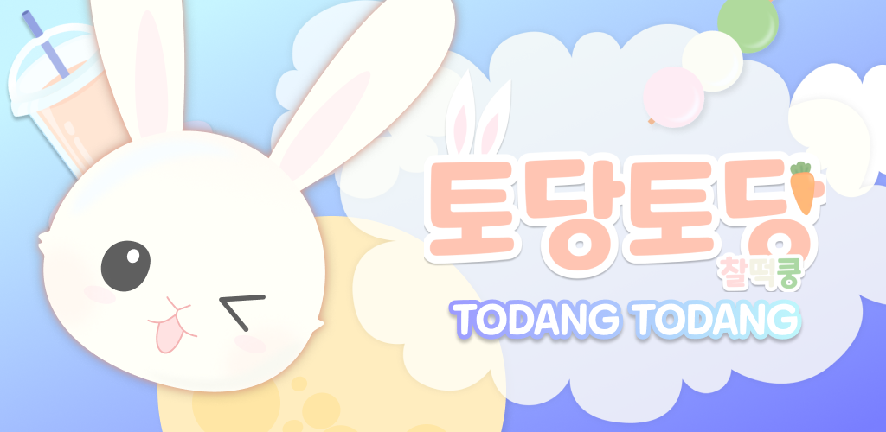

# 최종 readme

## 목차

| [📅 프로젝트 미리 보기 📅](#프로젝트-미리-보기) |
| :---: |
| [💼 개요 💼](#개요) |
| [📜 사용 기술 스택 📜](#사용-기술-스택) |
| [⚔️ 기술적 고민과 트러블 슈팅 ⚔️](#기술적-고민과-트러블-슈팅) |
| [💡 만든 사람들 💡](#만든-사람들) |

---

# 프로젝트 미리 보기

### [📹 ⭐ 시연 영상 보기 ⭐](https://www.youtube.com/watch?v=e9uwlPD9TDc)

### [🌈 팀 노션 🌈](https://www.notion.so/zl-4c1a665e36aa4a47b40d4a064666cc6d?pvs=21)

### 게임 미리보기

- 게임 내용
    - 떡과 차를 만들어서 판매하는 3D 타이쿤 게임 입니다.
    - 재고관리와 업그레이드 시스템을 통해 최종적으로 평점 5점을 달성하여 떡집을 물려받는 스토리의 게임입니다.

[📌 목차로 돌아가기 📌](#목차)

---

# 개요

| 게임명 | 토당토당 찰떡쿵 |
| --- | --- |
| 장르 | 음식 판매 및 경영 타이쿤 |
| 개발 환경 | Unity 2022.3.2f1 |
| 타겟 플랫폼 | Android / PC / Web |
| 개발 기간 | 2023.10.23 ~ 2023.12.15 |

[📌 목차로 돌아가기 📌](#목차)

---

# 사용 기술 스택

[[FSM] 플레이어의 상태관리를 위한 상태머신](/Detail/01.FSM/)

[[ObjectPool] 객체 재활용을 통한 생성 오버헤드를 줄이자](Detail/02.ObjectPool/)

[[Singleton&Generic] UI를 편리하게 관리하기 위한 UIManager](Detail/03.Singleton&Generic/)

[[MVC 개선] MVC를 확장성 있게 변형한 Inventory 구현](Detail/04.MVC/)

[[New InputSystem] 크로스 플랫폼 대응](Detail/05.New%20InputSystem/)

[[IMGUI] 빠른 개발과 테스트를 위한 Cheater](Detail/06.IMGUI/)

[[ObserverPattern] 다양한 데이터를 저장하는 DataManager](Detail/07.ObserverPattern/)

[[인터페이스] 다형성을 활용한 주방 기구 설계](Detail/08)

[[Firebase Analytics] 게임 플레이 분석을 위한 외부 모듈 사용](/Detail/09.FirebaseAnalytics)

[[해상도 대응] 다양한 기기에서 적절하게 보여주기 위한 방법](/Detail/10.ResolutionHanding)

[📌 목차로 돌아가기 📌](#목차)

---

# 기술적 고민과 트러블 슈팅

**[기술적 고민]**

[인벤토리 탭 UI의 구현 방식](/Detail/11.InventoryTab)

[요리 과정을 검증하는 방식](/Detail/12.CheckFoodMethod)

[UIManager를 통해 Popup들을 관리하는 방식 ](/Detail/13.UIManager)

**[트러블 슈팅]**

[마우스 좌클릭의 동작 ](/Detail/14.MouseAndButtonConflict)

[손님 AI의 Trigger 충돌 중복 ](/Detail/15.CustomerTriggerConflict)

[📌 목차로 돌아가기 📌](#목차)

---

## 만든 사람들

| 이름  | 태그  | 담당  | Github 주소  | 블로그 주소 |
| --- | --- | --- | --- | --- |
| 노동균 | 팀장 | 손님AI, 뉴스, 프롤로그 씬, 게임 엔딩 씬, 데이터, Cheater, 애널리틱스  | [찾아가기](https://github.com/shehdrbs123) | [보러가기](https://blog.naver.com/shehdrbs123) |
| 김정민 | 부팀장 | 인벤토리, 장식품 상점, 튜토리얼, 게임 오버 씬, 연습모드, 오브젝트 풀링, UIManager, UI디자인 | [찾아가기](https://github.com/j-miiin) | [보러가기](https://velog.io/@lazypotato) |
| 박희원  | 팀원 | 재료주문, 하루결산, 게임설정, 해상도대응, 파산씬, Sound | [찾아가기](https://github.com/phw97123) | [보러가기](https://hwon-note.tistory.com/) |
| 이현지 &nbsp;&nbsp;&nbsp;&nbsp;&nbsp;| 팀원 &nbsp;&nbsp;&nbsp;&nbsp;&nbsp;&nbsp;| 플레이어, 입력시스템, 주방기구, 뉴스, 연습모드, 쿡북, 닷트윈, 애니메이션 디자인, UI디자인 | [찾아가기](https://github.com/szlovelee) &nbsp;&nbsp;&nbsp;&nbsp;&nbsp;&nbsp;&nbsp;&nbsp;&nbsp; | [보러가기](https://szloveleesz.tistory.com/) &nbsp;&nbsp;&nbsp;&nbsp;&nbsp;&nbsp;&nbsp;&nbsp;&nbsp;|

[📌 목차로 돌아가기 📌](#목차)
